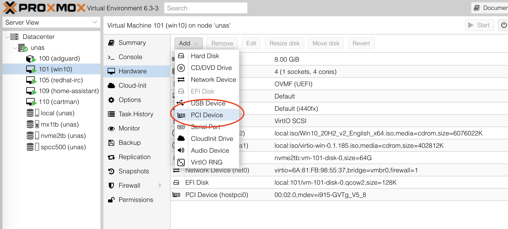
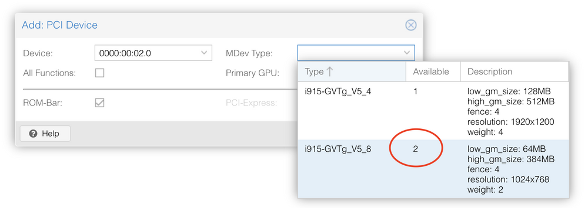
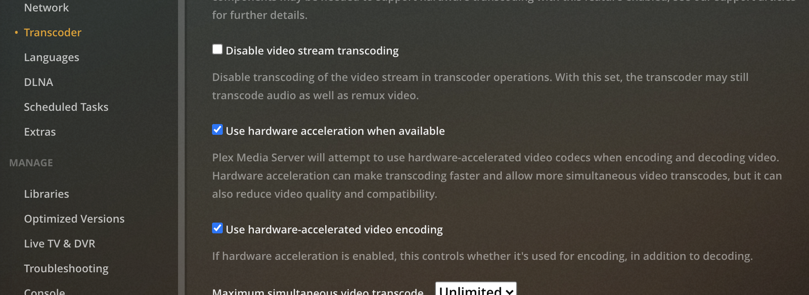
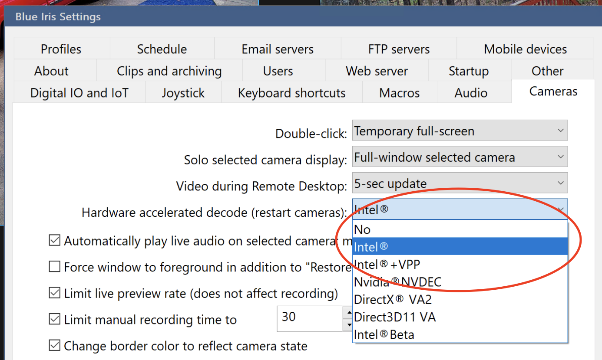
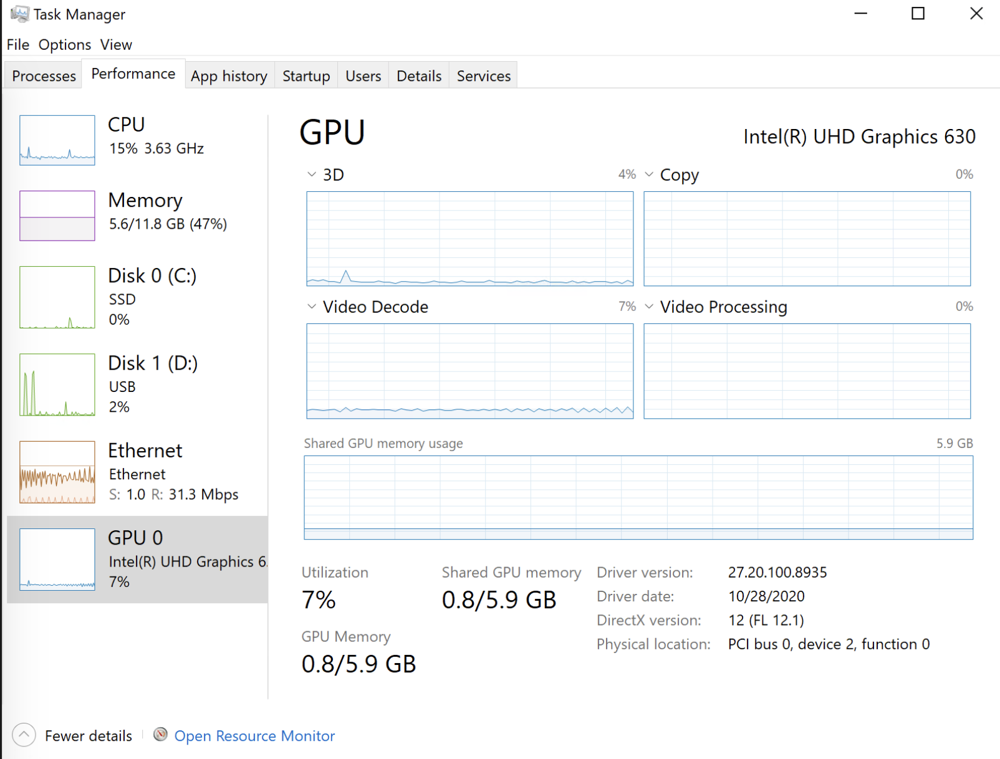

# Passthrough Intel iGPU with GVT-g to a VM and use Quick Sync with Plex in docker on Proxmox

PCIe passthrough is a technology that permits Virtual Machines direct access to the underlying hardware of a system. Want to play video games in a VM? Passthrough the GPU. Want to run OPNsense in a VM? Passthrough a dedicated NIC card.

!!! info
    This post was originally published at [blog.ktz.me](https://blog.ktz.me/passthrough-intel-igpu-with-gvt-g-to-a-vm-and-use-it-with-plex/).

What if you want to run Plex in a VM and take advantage of hardware accelerated decoding? Specifically to use the Intel [Quick Sync](https://en.wikipedia.org/wiki/Intel_Quick_Sync_Video) functionality built-in to most modern Intel CPU graphics units. It's actually very easy with Proxmox, here's how to do it.

!!! danger
    Since publication I have abandoned this method. See my reasoning in [this blog post](https://blog.ktz.me/why-i-stopped-using-intel-gvt-g-on-proxmox/).



!!! note
    This [blog post](https://cetteup.com/216/how-to-use-an-intel-vgpu-for-plexs-hardware-accelerated-streaming-in-a-proxmox-vm/) which was helpful in my research for this topic.

Passing through an entire GPU is very useful for specific tasks but isn't a very efficient use of resources. Wouldn't it be nice if we could slice up 1 GPU and use it with multiple VMs at once? 

That is precisely what [GVT-g](https://wiki.archlinux.org/index.php/Intel_GVT-g) permits us to do! 

Take the iGPU and give a VM, or multiple VMs, a slice of that graphics chip to do with whatever it wants. In our case, we'll use the Quick Sync portion of the iGPU to transcode Plex H264 streams in one VM and Blue Iris streams in another.

<iframe width="760" height="415" src="https://www.youtube.com/embed/IXUS1W7Ifys" frameborder="0" allow="accelerometer; autoplay; clipboard-write; encrypted-media; gyroscope; picture-in-picture" allowfullscreen></iframe>

If you're not convinced yet, take a look this video from Wendell who explains in a lot of detail why this technology is so cool! Intels rumoured upcoming XE graphics card might support it but until then, we'll have to make do with the iGPU in your CPU.

## Power Usage

Full details in episode 34 of Self-Hosted.

<iframe src="https://player.fireside.fm/v2/dUlrHQih+zIXDaNZP?theme=dark" width="740" height="200" frameborder="0" scrolling="no"></iframe>

If you needed even more convincing, take a look at the following numbers and see just how incredibly power efficient Quick Sync is compared to software based transcoding with Plex.

| CPU                  | Idle | Full load | Idle \(8 drives\) | 4K Transcode \(QS\) | 4K Transcode \(CPU\) | Motherboard         | PSU           |
|----------------------|------|-----------|-------------------|---------------------|----------------------|---------------------|---------------|
| 2x Xeon E5-2690v2 | 140w | 410w      | 185w              | n/a                 | 304w                 | Gigabyte GA\-7PESH2 | EVGA 750 G\+  |
| i5 8500              | 23w  | 93w       | 98w               | 35w                 | 75w                  | AsRock Z170         | Corsair SF600 |
| Helios64             | 14w  | 20w       | 51w               | n/a                 | n/a                  | Helios64            | Helios64      |


This was a legitmate "holy shit!" moment for me. Quick Sync is capable of a 4k transcode at 35w! This is a 10x reduction from the Dual Xeon setup I'd been using previously.

On top of that, Quick Sync can handle in excess of 20 1080p streams and about 5 4k transcodes in my testing. Astonishing given the power draw. Less power draw means less heat and lower electricity bills - what's not to like?!

## Setting up PCI passthrough (on Proxmox)

PCI passthrough requires a very particular set of hardware although things now are easier than they used to be a few years ago. For reference my hardware is an Intel i5 8500 and an AsRock Z370-I motherboard. I did an episode of Linux Unplugged where we went into full details on passthrough.

<iframe src="https://player.fireside.fm/v2/RUkczH-V+9ZRzR3sB?theme=dark" width="740" height="200" frameborder="0" scrolling="no"></iframe>

Full instructions are provided on the [Proxmox wiki] to enable passthrough. Once you've enabled IOMMU verify you've done so correctly like so:

```
alex@unas:~$ dmesg | grep -e DMAR -e IOMMU -e AMD-Vi
[    0.007086] ACPI: DMAR 0x00000000C547E208 0000A8 (v01 INTEL  KBL      00000001 INTL 00000001)
[    0.106528] DMAR: IOMMU enabled
...
[    4.262872] DMAR: Intel(R) Virtualization Technology for Directed I/O
```

Next, using the same Proxmox wiki page navigate to the section entitled 'Mediated Devices (vGPU, GVT-g)'.

## Mediated device setup (Intel GTV-g)

You already modified `/etc/modules` in the previous step, you'll want to add kvmgt as well in that file. 

Modify `/etc/default/grub` so that it looks like this when done:

```
alex@unas:~$ cat /etc/default/grub
# If you change this file, run 'update-grub' afterwards to update
# /boot/grub/grub.cfg.
# For full documentation of the options in this file, see:
#   info -f grub -n 'Simple configuration'

GRUB_DEFAULT=0
GRUB_TIMEOUT=5
GRUB_DISTRIBUTOR="Proxmox Virtual Environment"
GRUB_CMDLINE_LINUX_DEFAULT="quiet intel_iommu=on i915.enable_gvt=1 drm.debug=0"
GRUB_CMDLINE_LINUX="biosdevname=0"
```

Regenerate initramfs with update-initramfs -u -k all and reboot. To verify that mediated devices are now enabled take a look here:

```
root@unas:/home/alex# ls /sys/bus/pci/devices/0000\:00\:02.0/mdev_supported_types/
i915-GVTg_V5_4	i915-GVTg_V5_8
```

If you see `i915-GVTg_V5_4` you're good to go.

## Adding the iGPU to a VM

So far, everything we've done was covered in the Proxmox wiki and the previously linked [blog post](https://cetteup.com/216/how-to-use-an-intel-vgpu-for-plexs-hardware-accelerated-streaming-in-a-proxmox-vm/) but I wanted to use the iGPU for 2 VMs and there were a few small things to consider.

* Navigate to the VM you'd like to configure. Click `Add -> PCI Device`.


* Select the device `0000:00:02.0` (this doesn't appear to change in my testing between different machines) and then from the `MDev Type` drop down note that you have two options. 
    * `i915-GVTg_V5_4` is for some reason limited to 1 virtual device but `i915-GVTg_V5_8` presents us with 2 available devices. Select `V5_8` and hit Add.



* Repeat these steps for the second VM you'd like to use the iGPU with.

## Plex Hardware Acceleration

!!! info
    Hardware acceleration is a [Plex Pass](https://support.plex.tv/articles/115002178853-using-hardware-accelerated-streaming/) feature.

Some of you will think I'm crazy but I run my Perfect Media Server in a VM with an LSI HBA card passed through. On top of that abstraction I run each app in a container. Giving the container access to the hardware for GPU based transcoding requires adding a couple of lines to your container configuration - I use docker-compose.

```yaml
---
version: "2"
services:  
  plex:
    image: plexinc/pms-docker
    container_name: plex
    network_mode: host
    devices:
      - /dev/dri:/dev/dri
    volumes:
      - /mnt/tank/appdata/plex/config:/config
      - /mnt/storage:/data
    environment:
      - PUID=1000
      - PGID=1000
      - TZ=America/New_York
    restart: unless-stopped
```

The key here is `devices: /dev/dri:/dev/dri`. Once you've got the container up and running you'll need to tell Plex to use hardware transcoding in settings.



Once that is done, install `intel-gpu-tools` (assuming you're on Ubuntu this is available in the repos) and monitor the utilisation with `sudo intel_gpu_top`.


## Hardware acceleration in Blue Iris

In the second VM I run Blue Iris, my NVR software of choice. It requires Windows which is a shame but the software works very well.

Under Blue Iris settings ensure you have `Cameras -> Hardware accelerated decode` enabled and set to Intel.



I have 6 4k cameras coming into Blue Iris and these are the performance stats provided to me via Task Manager. I think you'll agree, very acceptable.



## Summary

The power of Quick Sync is very impressive for the amount of energy it consumes. In my opinion, this is the holy grail of media server technologies. Used gear can be had quite cheaply now, the i5 8500 used here was $110 off of eBay.

<iframe width="700" height="400" src="https://www.youtube.com/embed/Yl1twPPmEgc" frameborder="0" allow="accelerometer; autoplay; clipboard-write; encrypted-media; gyroscope; picture-in-picture" allowfullscreen></iframe>

Couple this with other great projects like PiKVM and consumer grade gear is really ready to be your next home server.