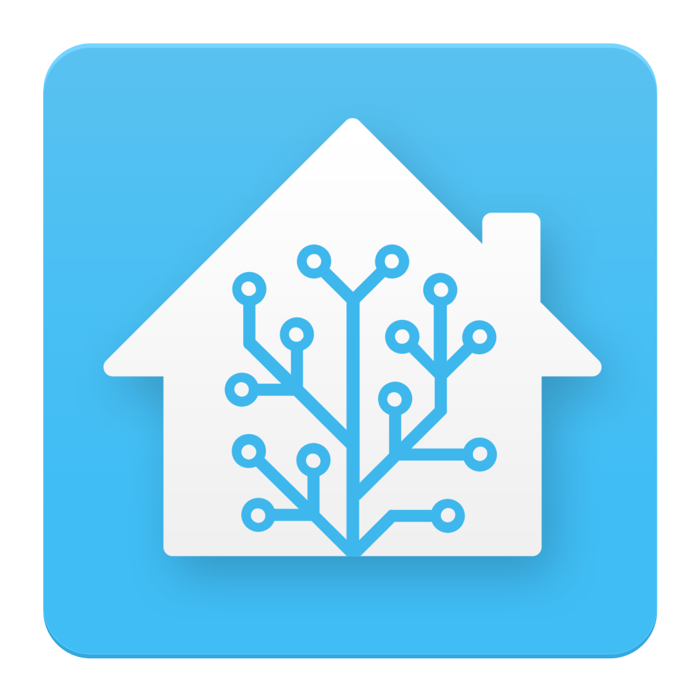

# Top 10 Self-Hosted apps

Storing and serving files is all well and good but with a little effort, we can replace dozens of hosted services that don't respect your privacy. Here are some of my favourite self-hosted app picks.

I would be remiss not to mention the [awesome-selfhosted](https://github.com/awesome-selfhosted/awesome-selfhosted) GitHub page before we get started. It is a list of [Free](https://en.wikipedia.org/wiki/Free_software) Software network services and web applications which can be hosted locally. There is also a [Non-Free](https://github.com/awesome-selfhosted/awesome-selfhosted/blob/master/non-free.md) page.

!!! info
    If you like this kind of thing, check out the [Self-Hosted](https://selfhosted.show) podcast over at [Jupiter Broadcasting](https://jupiterbroadcasting.com).

<iframe src="https://fireside.fm/player/v2/dUlrHQih+c60wLQ-X?theme=dark" width="740" height="200" frameborder="0" scrolling="no"></iframe>

## 1. Plex

[Plex](https://plex.tv) brings together all the media that matters to you. Your personal collection will look beautiful alongside stellar streaming content. Enjoy Live TV & DVR, a growing catalog of great web shows, news, and podcasts. It's finally possible to enjoy all the media you love in a single app, on any device, no matter where you are.

[Plex](https://plex.tv) is the reason you're even reading this page. It's what got me interested in Linux in the first place and is somewhat of a gateway drug for self-hosting and can be run as a [container](https://hub.docker.com/r/plexinc/pms-docker/). However, it is not open source and there are doubts about the future of Plex as they continue to add features and streaming services that [no-one asked for](https://www.reddit.com/r/PleX/comments/e62nbt/how_do_you_disable_the_new_plex_movies_feature/). Luckily, there are other options available.

Jellyfin and Emby are two notable players in this space (playback on any device) but we should also mention Kodi. Kodi is great is your use case is local only as automated media transcoding for the target device isn't something that this software does. But, for me, Plex is still the best overall in this category. It has the slickest UI and the most features. Despite this, the progress being made by Emby and Jellyfin recently is very impressive and these are both projects to watch closely.

**Similar or related projects:**

* [Emby](https://emby.media/)
* [Jellyfin](https://jellyfin.org/)
* [Kodi](https://kodi.tv/)

## 2. Nextcloud

[Nextcloud](https://nextcloud.com/) - The self-hosted productivity platform that keeps you in control.

Surely this pick needs no introduction. Think of Nextcloud somewhat like your own personal Dropbox replacement. Although, that is doing it a disservice because Nextcloud supports *many* more features than Dropbox. Nextcloud provide a [demo](https://nextcloud.com/try) if you'd like to try before you "buy" (Nextcloud is free).

The recently launched [Nextcloud Hub](https://nextcloud.com/hub) brings together several key areas of functionality:

* [Nextcloud Files](https://nextcloud.com/files) - offers universal file access on desktop, mobile and web. Find files with powerful search, share your thoughts in comments or lock files until you are done with them. 
* [Nextcloud Talk](https://nextcloud.com/talk) - delivers on-premises, private audio/video conferencing and text chat through browser and mobile interfaces with integrated screen sharing and SIP integration.
* [Nextcloud Groupware](https://nextcloud.com/groupware) - integrates Calendar, Contacts, Mail and other productivity features to help teams get their work done faster, easier and on your terms.

**Similar or related projects:**

* [Seafile](https://www.seafile.com/en/home/)
* [Filestash](https://github.com/mickael-kerjean/filestash)

## 3. Home Assistant

{: align=left width=150 }

Open source home automation that puts local control and privacy first. [Home Assistant](https://www.home-assistant.io/) is a truly remarkable project. At the time of writing it has over 1700 [integrations](https://www.home-assistant.io/integrations/) with all manner of devices, services and hardware supported. This is the true magic of Home Assistant.

A [demo](https://demo.home-assistant.io/#/lovelace/0) is available if you're curious to see it in action. But the real magic comes when you start automating your life to a point where when Home Assistant isn't there, you miss it. Automate the lights, climate control and yes, even your dog (via a bedtime routine) with Home Assistant!

A fantastic resource to learn more about the project is YouTube. [Dr Zzzs](https://www.youtube.com/c/DrZzs), [The Hook Up](https://www.youtube.com/c/TheHookUp), [Intermit.tech](https://www.youtube.com/c/IntermitTech), [Paul Hibbert](https://www.youtube.com/c/PaulHibbert) and [DigiblurDIY](https://www.youtube.com/c/digiblurDIY) are some of the most well-known channels. This isn’t an exhaustive list but should give you plenty of material to work with if you’re in need of inspiration or buying advice.

Home Assistant can be run as a standalone container, on a Raspberry Pi, as a VM and countless [other ways](https://www.home-assistant.io/getting-started/). The learning curve is real but this project really is worth your time to investigate.

## 4. Smokeping

* todo

## 5. Grafana

* todo

## 6. Lychee

* todo

## 7. Librespeed

A speed test tool that can be run on your LAN or hosted in the cloud. This is available as a Self-Hosted [container](https://hub.docker.com/r/linuxserver/librespeed) as well as at [librespeed.org](https://librespeed.org/).

This is really useful when you want to test the speed between your current system and wherever you are running this container. Want to test the speed between you and your cloud based VPS? Or check that your wifi is performing well?

By running this container on your LAN you're able to remove the internet from the equation and get a better idea about what's going on your LAN.

## 8. Gitea

* todo

## 9. Tiddlywiki

* todo

## 10. Vabene1111/recipes

* todo